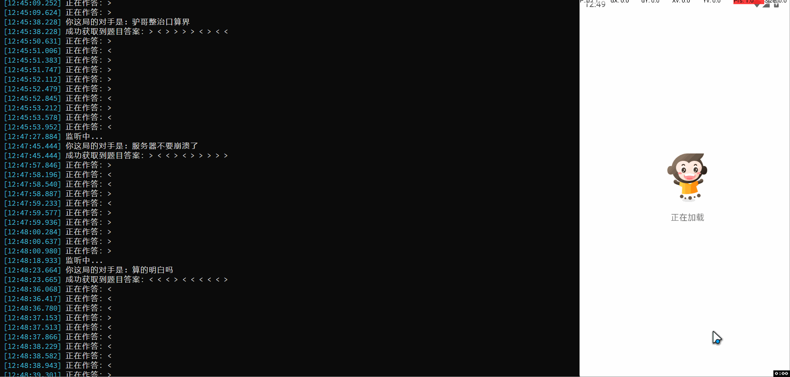

# XiaoYuanSolver


小猿口算 pk一把梭脚本

采用mitm抓包获取题目和答案信息，然后adb shell模拟鼠标滑动输入。随便写的shi山代码，各位看官看个乐子就好

## Preview



## Usage

1. 安装依赖

```bash
pip install -r requirements.txt
```

2. 配置 adb 调试

3. 配置安卓代理，需要安装mitmproxy CA 证书，网上教程很多这里不再赘述

4. 运行, 可以用绝对路径，也可以配置环境变量

```bash
mitmweb.exe -s main.py -p 8080
```

## Star History

[](https://star-history.com/#ph0ebus/XiaoYuanSolver&Date)
